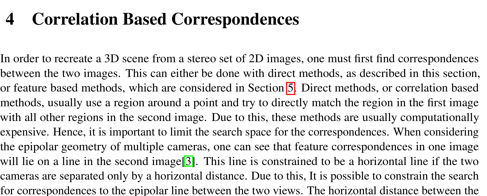
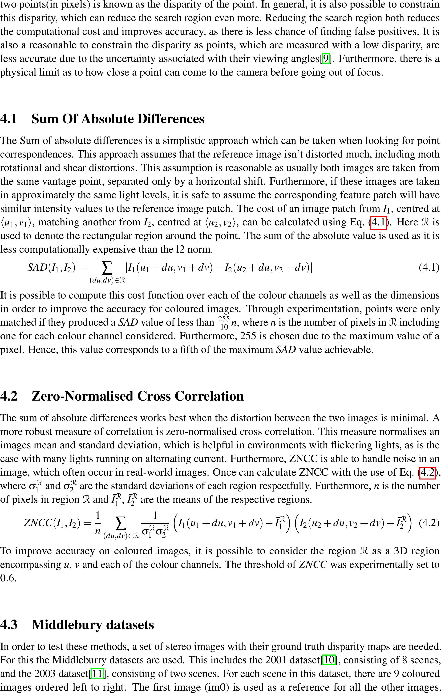
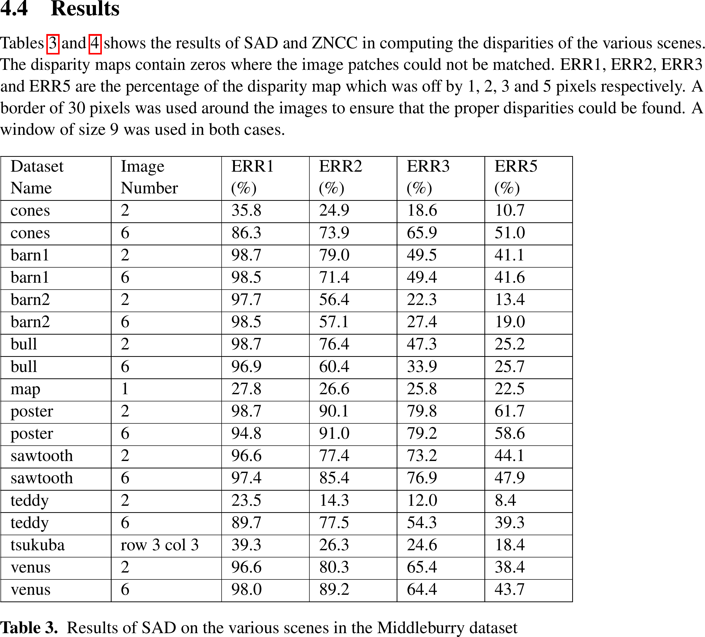
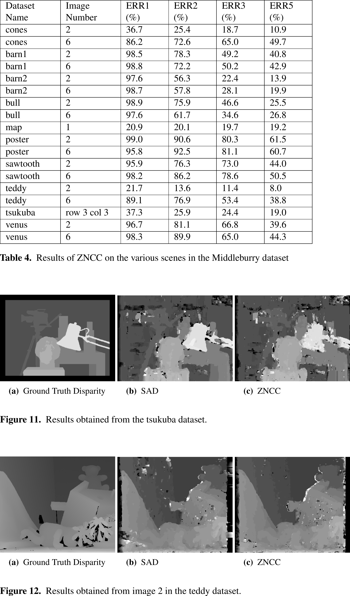
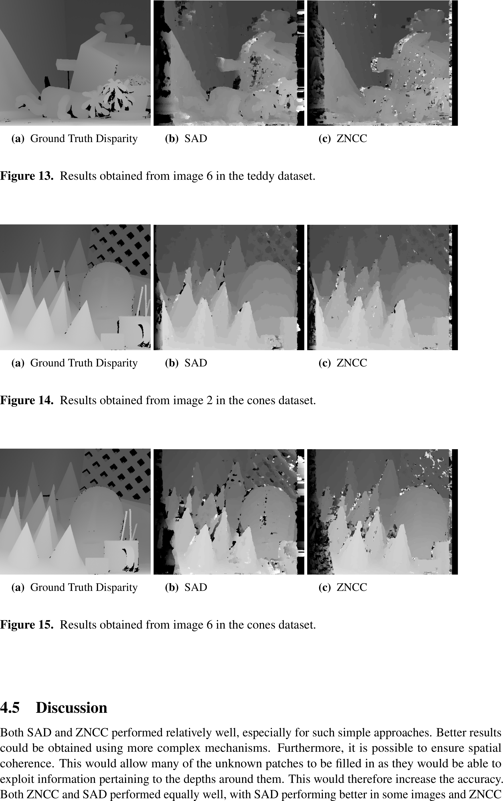
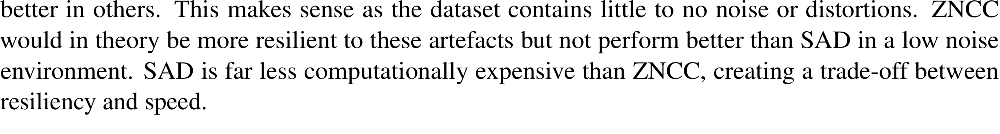
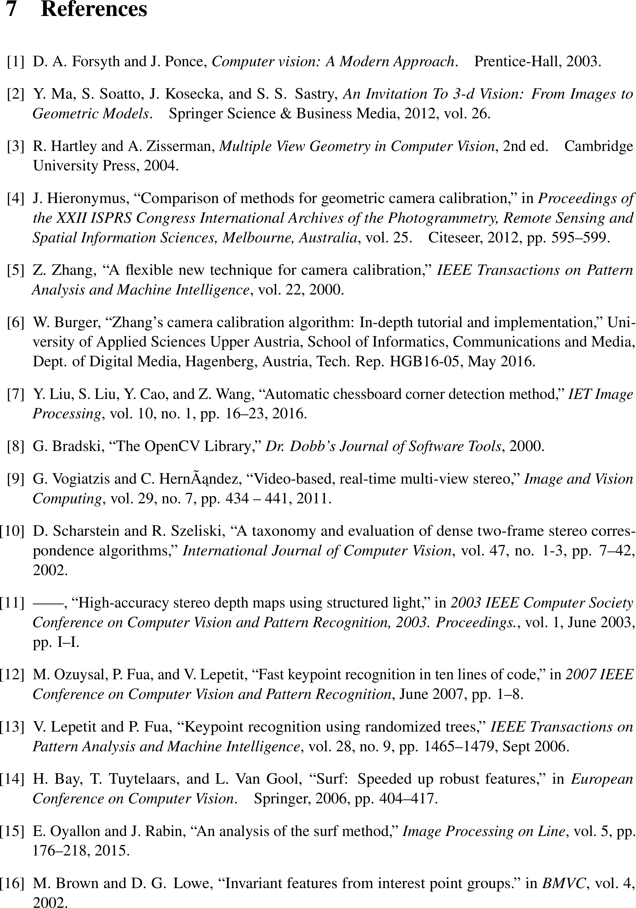

# Dense Imace Corespondance

> Implements methods from first principals to produce disparity maps from a set of images.

This repo includes implementations of Sum of Absolute Differences (SAD) and Zero-Normalised Cross Corelation (ZNCC).

---

## Table of Contents (Optional)

- [Installation](#installation)
- [Usage](#usage)
- [Documentation](#documentation)
- [Disclamer](#disclamer)

---

## Installation

- Install python
- Install various depencancies such as numpy ( requirements.txt to come )
- Run the code

## Usage

- Coming soon

## Documentation

---

## Disclamer

This repository is for educational purposes only. The algorithms implemented here is my interpretation of the original authors' work. Due to this, they will most likely not produce the same results as the original implementations. All rights are reserved to the original authors of the papers this code was based on. 

